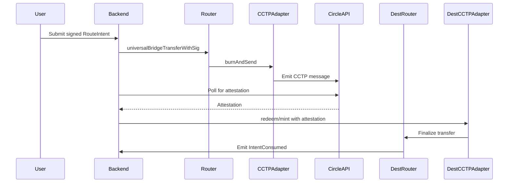

# Universal Router EVM Backend Blueprint

## 1. Contract Inventory & Surfaces

### Main Contracts
- `contracts/Router.sol` — Universal Router
  - **Entrypoints:**
    - `universalBridgeTransfer`, `universalBridgeTransferWithSig` (core bridging)
    - `setAdmin`, `setFeeRecipient`, `setAllowedTarget`, `setEnforceTargetAllowlist` (admin/config)
  - **Events:**
    - `BridgeInitiated(bytes32 routeId, address user, address token, address target, uint256 forwardedAmount, uint256 protocolFee, uint256 relayerFee, bytes32 payloadHash, uint16 srcChainId, uint16 dstChainId, uint64 nonce)`
    - `IntentConsumed(bytes32 digest, bytes32 routeId, address user)`
    - `AdminUpdated(address oldAdmin, address newAdmin)`
    - `FeeRecipientUpdated(address oldFeeRecipient, address newFeeRecipient)`
  - **Replay/Nonce Logic:**
    - `usedIntents` mapping (bytes32 digest → bool) for replay protection
    - `nonce` in RouteIntent struct (off-chain unique)
  - **Roles:**
    - `admin`, `feeRecipient` (settable via admin-only functions)

- `contracts/MockERC20.sol` — Test ERC20 (mint, approve)
- `contracts/utils/Create2Factory.sol` — Deterministic deployment (not directly used by backend)

### Message Format
- **RouteIntent (EIP-712):**
  - `{ routeId, user, token, amount, protocolFee, relayerFee, dstChainId, recipient, expiry, payloadHash, nonce }`
  - Signed by user, submitted by relayer/backend

## 2. CCTP Integration Map

- **Entrypoint:**
  - Router calls `CCTPAdapter.burnAndSend(usdc, amount, dstDomain, recipient, nonce, extraData)` (adapter contract, not in repo)
- **Message Structure:**
  - CCTP message: `{ message_hash, nonce, src_chain_id, dst_chain_id, src_domain, dst_domain, amount, recipient }`
- **Attestation Polling:**
  - Backend polls Circle API (`/v1/attestations/{message_hash}`)
  - Waits for attestation, then submits redeem/mint tx on destination chain
- **Domain IDs:**
  - Per-chain, e.g. Ethereum: 0, Avalanche: 1, Base: 3 (see Circle docs)
- **Retry/Idempotency:**
  - Use message_hash or global_route_id as idempotency key
  - Backend should retry with exponential backoff, handle Circle rate limits

## 3. Backend Services

- **Attestation Worker**
  - Polls Circle for attestation status
  - Submits proofs to destination chain (mint/redeem)
  - Handles retry/backoff, idempotency

- **Execution Relayer**
  - Watches EVM events (`BridgeInitiated`, `IntentConsumed`)
  - Builds and submits txs (universalBridgeTransfer, mint/redeem)
  - Manages gas, nonces, replay protection

- **Reconciliation & Accounting**
  - Records cross-chain transfer state machine:
    - Initiated → Pending → Attested → Executed → Failed/Refunded
  - Joins EVM events, Circle attestation, execution receipts

## 4. Postgres Schema (DDL)

```sql
CREATE TABLE transfers (
  transfer_id SERIAL PRIMARY KEY,
  src_chain_id INT,
  dst_chain_id INT,
  src_tx_hash TEXT,
  dst_tx_hash TEXT,
  route_id TEXT,
  global_route_id TEXT,
  user TEXT,
  token TEXT,
  amount NUMERIC,
  status VARCHAR,
  created_at TIMESTAMP DEFAULT now(),
  updated_at TIMESTAMP
);
CREATE TABLE messages (
  message_hash TEXT PRIMARY KEY,
  src_chain_id INT,
  dst_chain_id INT,
  src_domain INT,
  dst_domain INT,
  amount NUMERIC,
  recipient TEXT,
  nonce BIGINT,
  global_route_id TEXT,
  created_at TIMESTAMP DEFAULT now()
);
CREATE TABLE attestations (
  attestation_id SERIAL PRIMARY KEY,
  message_hash TEXT,
  attestation TEXT,
  status VARCHAR,
  received_at TIMESTAMP
);
CREATE TABLE executions (
  execution_id SERIAL PRIMARY KEY,
  global_route_id TEXT,
  message_hash TEXT,
  dst_chain_id INT,
  dst_tx_hash TEXT,
  status VARCHAR,
  executed_at TIMESTAMP
);
CREATE TABLE refunds (
  refund_id SERIAL PRIMARY KEY,
  global_route_id TEXT,
  message_hash TEXT,
  reason TEXT,
  refunded_at TIMESTAMP
);
CREATE TABLE fees (
  fee_id SERIAL PRIMARY KEY,
  global_route_id TEXT,
  protocol_fee NUMERIC,
  relayer_fee NUMERIC,
  asset TEXT,
  collector TEXT,
  applied_at TIMESTAMP
);
```

## 5. APIs & Webhooks

- **REST Endpoints:**
  - `POST /transfers` — create transfer intent (EIP-712 RouteIntent)
  - `GET /transfers/:id` — query transfer status
  - `GET /messages/:hash` — query CCTP message status
  - `GET /attestations/:hash` — query attestation status
  - `GET /executions/:id` — query execution status
  - `GET /fees/:id` — query fee application

- **Webhooks:**
  - `POST /webhook/circle` — receive attestation updates (if Circle supports)

## 6. Config & Secrets

- **ENV Names:**
  - `CIRCLE_API_BASE` — Circle API base URL
  - `CIRCLE_API_KEY` — Circle API key
  - `RPC_ETHEREUM`, `RPC_BASE`, ... — per-chain RPC URLs
  - `ROLE_KEY_ADMIN`, `ROLE_KEY_RELAYER` — backend role keys
  - `GAS_POLICY` — gas bumping policy

## 7. Diagrams (Mermaid)



## 8. Acceptance Checklist for EVM Backend

- [ ] Attestation Worker running, polling Circle, handling rate limits/backoff
- [ ] Execution Relayer watching EVM events, submitting txs, managing gas/nonces
- [ ] Reconciliation/Accounting joining EVM events, Circle attestation, execution receipts
- [ ] REST APIs and webhooks exposed for transfer creation/status
- [ ] Configs and secrets loaded (Circle API, RPCs, keys)
- [ ] Replay protection and idempotency enforced (message_hash/global_route_id)
- [ ] Reorg handling (confirmations before finalization)
- [ ] Fee applications indexed and queryable
- [ ] All references to file paths, event/function names in this repo are documented for listener/builder wiring

---

**References:**
- Entrypoints: `contracts/Router.sol` — universalBridgeTransfer, universalBridgeTransferWithSig
- Events: `BridgeInitiated`, `IntentConsumed`, `AdminUpdated`, `FeeRecipientUpdated` (see Router ABI)
- Message format: RouteIntent (see `script/signRoute.ts`)
- Tests: `test/router-sig.test.ts`, `test/Router.spec.ts` (see event emission, intent signing)
- Scripts: `script/signRoute.ts` (RouteIntent signing), `script/deploy.ts` (deployment)
- Replay/nonce: `usedIntents` mapping, `nonce` in RouteIntent
- CCTP integration: see README.md, deployment.md for flow and domain IDs
